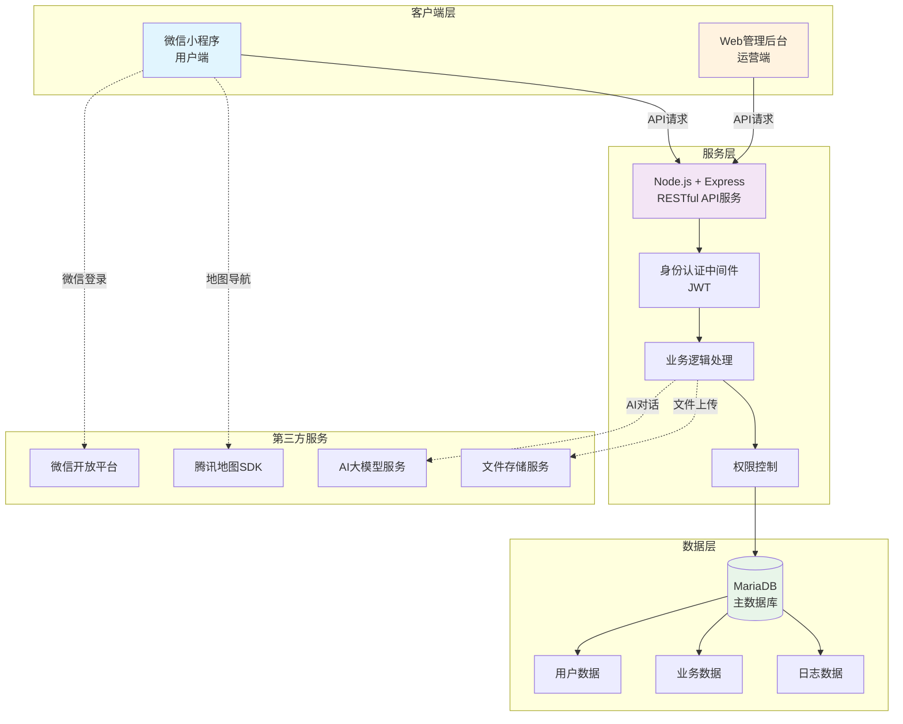
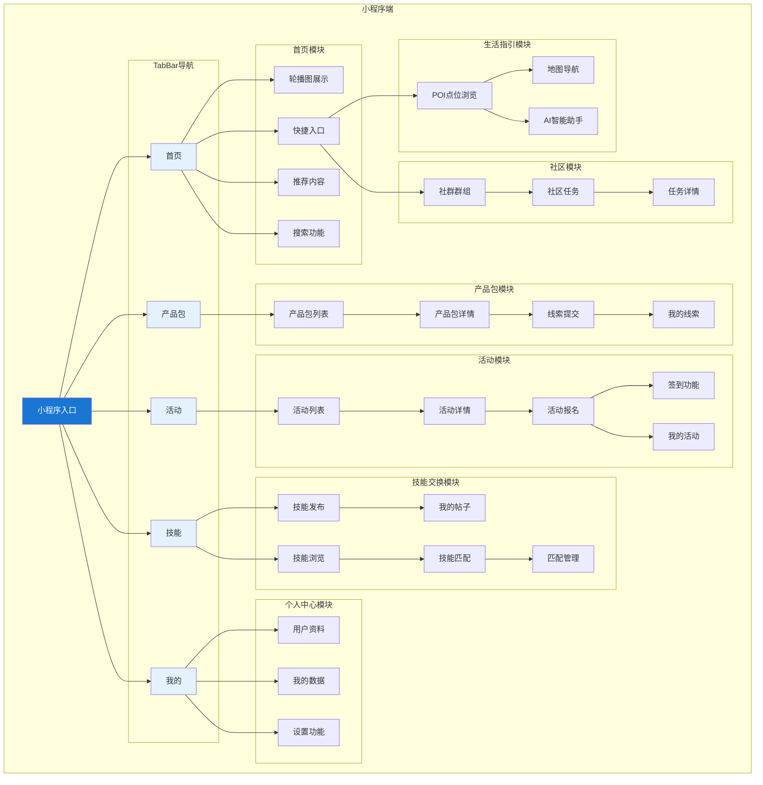
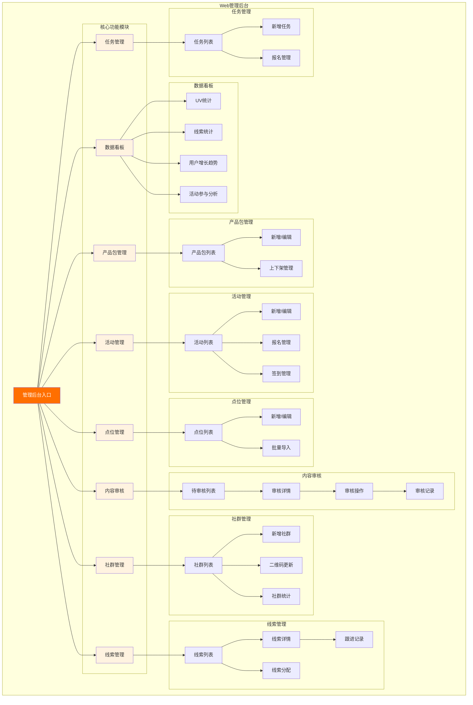
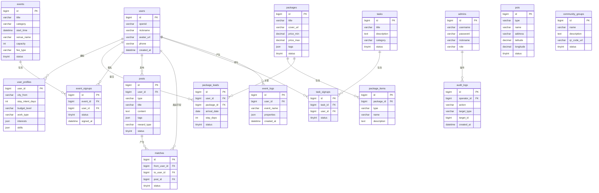
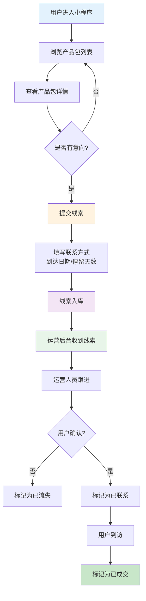
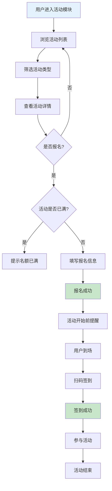
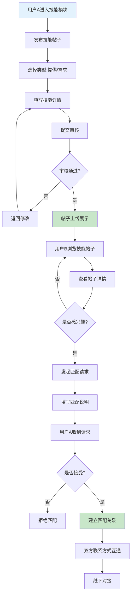
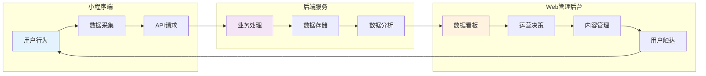

目录
1项目概要（一级标题黑体小二居中）	4
1.1 二级标题三号黑体	4
三级标题四号黑体	4
2项目背景（与第一部分同一个人）	4
2.1 xxxxxx	4
2.1.1 xxxxxx	4
2.1.2 xxxxxx	4
3目标客群深度画像 	4
4核心设计：“数字游民” 旅居产品包 	5
5核心设计：社群运营服务体系 	5
  5.1社群定位与核心服务理念
  5.2社群组织架构设计
  5.3 AI赋能社群运营的核心应用场景
  5.4 社群运营成效评估体系
6本地价值转化路径设计 	5
7本地合作对接方案（与6同一个人） 	5
8运营可持续性规划 	5
9预期社会与经济收益评估（与8同一个人） 	5
10项目实施保障 	6
11项目实施计划 （与10同一个人）	6
附录（根据需要）	6

1项目概要
1.1项目名称
河源市东源县数字游民旅居生态社区建设项目
1.2项目核心
依托东源县 “百千万工程” 人才干部培训基地 2 号楼为物理核心，打造集居住、工作、生活、社交、贡献于一体的数字游民旅居生态社区，围绕 “吸引、留存、转化” 三大核心目标，通过旅居产品包设计、社群运营服务体系搭建、本地价值转化路径构建，吸引数字游民集聚东源，推动其与本地乡村深度融合，将生态优势、区位优势转化为发展优势，以数字人才集聚赋能东源县乡村全面振兴，激活乡村旅居经济与数字产业发展新动能。
1.3项目基础
项目选址配套设施完善，拥有政策、资源、区位多重优势，政府提供融资、资金、培训全维度政策支持，基地具备办公、住宿、文体等成熟硬件条件，且毗邻东江、靠近乡村振兴示范点，为数字游民深度参与本地发展提供地理与实践基础。
1.4项目价值
本项目既填补了东源县数字旅居经济发展的空白，为数字游民提供优质的乡村旅居创业环境，又能通过数字游民的技能、资源与本地需求结合，带动乡村文旅、电商、文创等产业发展，实现数字人才入乡、融乡、兴乡的良性循环，助力东源县打造粤港澳大湾区数字游民旅居标杆目的地，推动乡村产业、人才、文化、生态、组织 “五大振兴” 落地见效。 
2项目背景
2.1 时代背景
2025 年 1 月，中共中央、国务院印发《乡村全面振兴规划 (2024-2027)》，明确提出加快数字乡村建设，扎实推进乡村 “五大振兴”，为乡村发展指明数字化、生态化融合方向。同时，全球智能设备互联与工作远程化趋势加速，“数字游民” 新兴社会群体快速形成，这类群体依托互联网实现异地远程工作，对兼具生态环境与网络基础的乡村聚居地需求日益增长。
中国乡村凭借原生态田园风光、静谧的生活环境、持续完善的网络基础设施及相对较低的生活成本，成为数字游民的首选聚居地，各地逐渐涌现青年乡村生态社区。在此时代背景下，乡村数字旅居经济成为连接数字人才与乡村振兴的重要纽带，既为数字游民提供了新的生活与工作选择，也为乡村引入高素质流动人才、激活乡村发展活力提供了新路径。
2.2 区域发展背景
本项目落地于河源市东源县，其地处粤港澳大湾区东北部，是珠江三角洲与粤东北山区的结合部，全面融入大湾区 1 小时经济生活圈，区位优势显著。东源县是全国首批 “绿水青山就是金山银山” 实践创新基地，斩获首批国家农业可持续发展试验示范区、中国生态旅游大县、广东省县级文明城市等多项荣誉，成功入选国家创新型县 (市) 建设、省 “百千万工程” 典型县。
东源县生态环境优越，森林覆盖率达 70.48%，水环境质量长期稳定在国家地表水 Ⅰ、Ⅱ 类标准；自然资源丰富，拥有多重国家级生态保护地与特色农业、矿产资源；文化底蕴深厚，作为客家文化核心区域之一，孕育了阮啸仙等历史名人，红色文化与客家文化交融；产业发展多元，形成先进材料、高端装备制造等主导产业，同时大力发展乡村旅游、特色农业等乡村产业，具备发展旅居经济的先天优势与产业基础。
2.3 资源与落地基础背景
项目选定东源 “百千万工程” 人才干部培训基地 2 号楼为数字游民社区核心选址，该基地坐落于义合镇下屯村阮啸仙故居西侧、东江河畔，距市区、县城约 16 公里，既可让数字游民享受宁静的自然生态环境，又能快速衔接县城生活圈与周边乡村振兴示范点，为其深度体验河源本土文化、参与本地发展共创提供绝佳的地理与情感支点。
基地为集康养、旅游、乡村振兴于一体的综合性教育培训基地，总占地面积约 18.40 万㎡，配套教学楼、综合楼、公寓、文体活动中心等完善的公共设施，拥有多规格教室、研讨室、羽毛球馆、健身房等功能空间，可满足数字游民工作、社交、休闲等多元需求。其中 2 号楼建筑面积 2300㎡，已建设完工，为社区整体布局规划设计提供现成的物理载体；基地内部分闲置平台也为存量资产激活、打造数字人才集聚空间提供了改造基础。同时，东源县政府为项目提供融资、资金、培训全维度政策支持，从贷款贴息、创业补贴到技能培训、导师指导，形成完善的政策支撑体系，为项目落地与运营保驾护航。
3经营内容（产品/服务）

4功能/技术实现
本项目采用"小程序端 + Web管理后台 + 后端服务"三端分离的技术架构，构建完整的数字游民旅居生态平台。小程序端面向数字游民用户提供旅居服务，Web管理后台面向运营团队进行业务管理，后端服务提供统一的API接口与数据支撑。

4.1 系统整体架构设计
4.1.1 架构设计理念
系统采用前后端分离的微服务架构设计理念，将用户端（小程序）、运营端（Web后台）与后端服务解耦，实现独立开发、独立部署、独立扩展。整体架构分为三层：

**客户端层**：微信小程序面向数字游民用户，提供产品包浏览、活动报名、技能交换等核心服务；Web管理后台面向运营团队，提供数据看板、内容审核、线索管理等运营支撑功能。

**服务层**：基于Node.js + Express构建RESTful API服务，提供统一的业务逻辑处理、数据校验、权限控制等功能，支持小程序端和管理后台的并发请求。

**数据层**：采用MariaDB关系型数据库存储用户数据、产品包信息、活动记录、技能帖子等核心业务数据，确保数据一致性与事务完整性。

**【图4-1 系统整体架构图】**

4.1.2 技术选型说明
| 层级 | 技术选型 | 版本 | 选型理由 |
|------|----------|------|----------|
| 小程序端 | 微信小程序原生框架 | - | 原生性能最优，用户体验流畅，无需跨平台适配 |
| Web前端 | Vue.js + Element Plus | 3.4.0 / 2.4.4 | 组件化开发效率高，Element Plus提供丰富的企业级UI组件 |
| 构建工具 | Vite | 5.0.10 | 新一代构建工具，开发启动快，热更新响应迅速 |
| 后端框架 | Express.js | 4.18.2 | 轻量级、生态丰富、中间件机制灵活 |
| 运行环境 | Node.js | LTS | 高并发处理能力强，前后端技术栈统一 |
| 数据库 | MariaDB | 10.11.7 | MySQL兼容，性能优异，开源免费 |
| 身份认证 | JWT | 9.0.2 | 无状态认证，支持分布式部署 |
| 图表可视化 | ECharts | 5.4.3 | 功能强大，支持多维度数据展示 |

4.1.3 架构优势分析
**高可用性**：三端分离架构支持独立部署与水平扩展，单点故障不影响整体系统运行。

**开发效率**：前后端分离使开发团队可并行工作，Vue组件化开发提升代码复用率。

**用户体验**：小程序原生框架确保流畅的移动端体验，Web后台响应式设计适配多终端。

**安全可控**：JWT双令牌机制实现用户端与管理端权限隔离，bcrypt加密保障密码安全。

**易于维护**：RESTful API规范统一接口风格，模块化代码结构便于后期维护升级。

4.2 小程序端功能模块（用户端）
小程序端是面向数字游民用户的核心服务入口，采用底部TabBar导航设计，包含首页、产品包、活动、技能、我的五大核心模块。

**【图4-2 小程序端功能模块架构图】**

4.2.1 首页模块
首页作为用户进入平台的第一触点，承担着信息聚合与流量分发的核心功能。

**轮播图展示**：顶部轮播区域展示精选产品包、热门活动、社区公告等核心信息，支持点击跳转详情页。

**快捷入口**：提供产品包、活动、生活指引、技能交换等核心功能的快捷访问入口，降低用户操作路径。

**推荐内容**：智能推荐热门产品包、近期活动、优质技能帖子，提升用户发现效率。

**搜索功能**：支持关键词搜索产品包、活动、技能帖子，快速定位目标内容。

4.2.2 产品包模块
产品包模块是平台的核心商业模块，展示旅居产品包信息并收集用户线索。

**产品包列表**：展示所有上线产品包，支持按价格区间、标签分类筛选，卡片式展示封面图、标题、价格区间、标签等信息。

**产品包详情**：展示产品包完整信息，包含项目介绍、服务内容、可选服务、价格说明、预约须知等，支持用户收藏与分享。

**线索提交**：用户可提交旅居意向线索，填写预计到达日期、停留天数、人数、联系方式等信息，运营团队将在后台跟进处理。

**我的线索**：用户可查看已提交线索的处理状态，包括待跟进、已联系、已成交等状态。

4.2.3 活动模块
活动模块支持社区活动的发布、浏览、报名全流程管理。

**活动列表**：展示社区活动，支持按活动类型（社交活动、技能分享、户外探索、文化体验等）筛选，显示活动时间、地点、费用、剩余名额等信息。

**活动详情**：展示活动完整信息，包含活动介绍、时间地点、费用说明、报名须知等，支持地图导航至活动地点。

**活动报名**：用户可一键报名活动，填写报名信息后获得报名资格，支持取消报名功能。

**签到功能**：活动当天支持现场签到，记录用户参与情况。

**我的活动**：用户可查看已报名活动的状态，包括待参加、已完成、已取消等。

4.2.4 生活指引模块
生活指引模块为数字游民提供本地生活服务信息，帮助其快速融入社区。

**POI点位浏览**：展示住宿、餐饮、交通、医疗、娱乐、办公等分类点位信息，包含名称、地址、联系方式、营业时间、用户评价等。

**地图导航**：集成腾讯地图，支持点位地图展示与导航功能，一键跳转第三方地图APP进行导航。

**AI智能助手**：接入AI对话能力，用户可通过自然语言咨询旅居相关问题，获取智能推荐与解答。

4.2.5 技能交换模块
技能交换模块是数字游民社区的核心社交功能，促进成员间的技能互助与价值交换。

**技能发布**：用户可发布技能帖子，选择类型（技能提供/技能需求），填写技能名称、详细描述、交换方式（免费/付费/互惠）、标签等信息。

**技能浏览**：展示所有已审核通过的技能帖子，支持按类型、标签筛选，卡片式展示关键信息。

**技能匹配**：用户可对感兴趣的技能帖子发起匹配请求，填写匹配说明，等待对方确认。

**匹配管理**：用户可查看收到的匹配请求，选择接受或拒绝，建立技能交换关系。

**我的帖子**：用户可管理已发布的技能帖子，查看匹配状态，进行编辑或下架操作。

4.2.6 社区模块
社区模块支持社群运营与社区任务管理，增强用户粘性与社区归属感。

**社群群组**：展示平台运营的微信社群群组，包含群名称、简介、二维码，用户可扫码加入感兴趣的社群。

**社区任务**：展示社区发布的任务（如志愿服务、内容创作、活动协助等），用户可报名参与任务，获得社区积分或奖励。

**任务详情**：展示任务完整信息，包含任务描述、时间要求、奖励说明等。

4.2.7 个人中心模块
个人中心提供用户信息管理与个人数据查看功能。

**用户资料**：展示用户头像、昵称、手机号等基本信息，支持编辑个人资料，填写来源城市、预计停留天数、预算水平、工作类型、兴趣爱好、技能标签等画像信息。

**我的数据**：聚合展示我的线索、我的活动、我的帖子、我的匹配等个人数据入口。

**设置功能**：提供账号设置、隐私设置、关于我们等功能入口。

4.3 Web管理后台功能模块（运营端）
Web管理后台是面向运营团队的管理平台，提供数据看板、业务管理、内容审核等运营支撑功能。

**【图4-3 Web管理后台功能模块架构图】**

4.3.1 数据看板
数据看板是运营决策的核心工具，提供多维度数据可视化展示。

**核心指标统计**：展示UV（独立访客数）、线索数、活动报名数、到访数等核心运营指标，支持按日/周/月维度查看趋势变化。

**用户增长趋势**：折线图展示用户注册量、活跃用户数的变化趋势，帮助运营团队把握用户增长节奏。

**产品包分类统计**：饼图展示各类型产品包的线索分布，分析用户偏好。

**活动参与分析**：柱状图展示各活动的报名人数、签到率，评估活动运营效果。

**实时数据更新**：数据看板支持实时刷新，确保运营团队掌握最新运营状况。

4.3.2 产品包管理
产品包管理模块支持旅居产品包的全生命周期管理。

**产品包列表**：展示所有产品包，支持按状态（草稿/上架/下架）筛选，显示标题、价格区间、状态、创建时间等信息。

**新增产品包**：填写产品包基本信息（标题、封面、价格区间、标签），添加产品包项目（住宿、餐饮、办公、活动等），设置可选服务与增值项目。

**编辑产品包**：修改产品包信息，支持上下架操作，调整产品包状态。

**删除产品包**：支持删除草稿状态的产品包，已上架产品包需先下架方可删除。

4.3.3 活动管理
活动管理模块支持社区活动的发布与管理。

**活动列表**：展示所有活动，支持按状态（草稿/报名中/进行中/已结束）筛选，显示活动标题、类型、时间、报名人数等信息。

**新增活动**：填写活动基本信息（标题、类型、时间、地点、费用、名额），上传活动封面，编写活动详情介绍。

**报名管理**：查看活动报名名单，导出报名数据，支持手动签到与批量操作。

**编辑活动**：修改活动信息，支持取消活动操作，自动通知已报名用户。

4.3.4 点位管理
点位管理模块维护生活指引的POI数据。

**点位列表**：展示所有POI点位，支持按类型（住宿/餐饮/交通/医疗/娱乐/办公）筛选，显示名称、地址、状态等信息。

**新增点位**：填写点位基本信息（名称、类型、地址、联系方式），设置经纬度坐标，上传点位图片。

**编辑点位**：修改点位信息，支持上下架操作。

**批量导入**：支持Excel批量导入点位数据，提升数据录入效率。

4.3.5 内容审核
内容审核模块管理用户发布的技能帖子，确保社区内容质量。

**待审核列表**：展示待审核的技能帖子，显示发布者、标题、类型、发布时间等信息。

**审核详情**：查看帖子完整内容，包含技能描述、交换方式、标签等详细信息。

**审核操作**：支持通过或拒绝操作，拒绝时需填写拒绝原因，系统将通知发布者。

**审核记录**：保留所有审核记录，支持按时间、操作人查询。

4.3.6 线索管理
线索管理模块跟进用户提交的产品包线索，实现销售转化。

**线索列表**：展示所有线索，支持按状态（待跟进/已联系/已成交/已流失）筛选，显示用户信息、意向产品包、提交时间等。

**线索详情**：查看线索完整信息，包含用户联系方式、预计到达日期、停留天数、人数等。

**跟进记录**：记录每次跟进情况，支持添加跟进备注，更新线索状态。

**线索分配**：支持将线索分配给指定运营人员跟进。

4.3.7 社群管理
社群管理模块维护平台运营的微信社群群组。

**社群列表**：展示所有社群群组，显示群名称、简介、成员数、状态等信息。

**新增社群**：填写群名称、简介，上传群二维码图片。

**二维码更新**：支持更新群二维码，解决二维码过期问题。

**社群统计**：展示各社群的成员增长趋势与活跃度数据。

4.3.8 任务管理
任务管理模块发布与管理社区任务。

**任务列表**：展示所有任务，支持按状态筛选，显示任务标题、类型、报名人数等信息。

**新增任务**：填写任务基本信息（标题、类型、描述、时间要求、奖励说明）。

**报名管理**：查看任务报名名单，确认参与人员。

4.4 技术实现方案
4.4.1 前端技术实现
**小程序端技术实现**
- 采用微信小程序原生框架开发，使用WXML模板语言、WXSS样式语言、JavaScript逻辑层
- 自定义TabBar组件实现底部导航栏，提升视觉一致性
- 封装统一API请求模块，实现请求拦截、响应处理、错误统一处理
- 使用小程序本地存储缓存用户信息与常用数据，减少网络请求
- 集成腾讯地图SDK，实现POI点位展示与导航功能

**Web管理后台技术实现**
- 采用Vue 3 Composition API开发，使用Pinia进行状态管理
- Element Plus组件库提供表格、表单、对话框、分页等企业级UI组件
- Axios封装HTTP请求，实现请求拦截、响应拦截、Token自动刷新
- Vue Router实现路由管理与权限控制
- ECharts实现数据可视化图表展示
- Vite构建工具实现快速热更新与生产环境优化

4.4.2 后端技术实现
**服务架构**
- 基于Express.js框架构建RESTful API服务
- 采用MVC分层架构：Routes（路由层）→ Controllers（控制器层）→ Models（数据模型层）
- 中间件机制实现身份认证、权限校验、错误处理、日志记录

**身份认证**
- JWT（JSON Web Token）实现无状态身份认证
- 双令牌机制：用户端Token与管理端Token分离，权限隔离
- bcryptjs实现密码加密存储，保障账号安全

**API设计**
- RESTful风格API设计，统一响应格式：{ code, message, data }
- 小程序端API前缀：/api/*
- 管理后台API前缀：/admin/*
- 统一错误码定义，便于前端处理各类异常

**文件上传**
- multer中间件处理图片上传
- 支持产品包封面、活动封面、点位图片、群二维码等图片上传

4.4.3 数据库设计
**核心数据表**
| 表名 | 描述 | 主要字段 |
|------|------|----------|
| users | 用户表 | id, openid, nickname, avatar_url, phone, created_at |
| user_profiles | 用户资料表 | user_id, city_from, stay_intent_days, budget_level, work_type, interests, skills |
| packages | 产品包表 | id, title, cover_url, price_min, price_max, tags, status |
| package_items | 产品包项目表 | id, package_id, type, name, description |
| package_leads | 产品包线索表 | id, user_id, package_id, arrival_date, stay_days, status |
| events | 活动表 | id, title, category, start_time, venue_name, capacity, fee_type, status |
| event_signups | 活动报名表 | id, event_id, user_id, status, signed_at |
| pois | 点位表 | id, type, name, address, latitude, longitude, status |
| posts | 技能帖子表 | id, user_id, type, title, content, tags, reward_type, status |
| matches | 技能匹配表 | id, from_user_id, to_user_id, post_id, status |
| community_groups | 社群群组表 | id, name, description, qr_code_url, status |
| tasks | 任务表 | id, title, description, category, status |
| admins | 管理员表 | id, username, password, nickname, role |

**【图4-4 数据库ER关系图】**

**数据安全**
- 敏感字段加密存储（密码使用bcrypt加密）
- 数据库连接池管理，控制并发连接数
- SQL注入防护，使用参数化查询

4.4.4 AI能力集成
平台接入AI智能助手，为数字游民提供智能咨询服务。

**应用场景**
- 旅居咨询：回答关于住宿、餐饮、交通等生活问题
- 产品推荐：根据用户需求智能推荐合适的产品包
- 活动推荐：根据用户兴趣推荐相关活动
- 社区指引：介绍社区规则、设施使用等

**技术实现**
- 通过API接口对接AI大模型服务
- 对话上下文管理，支持多轮对话
- 响应结果缓存，提升响应速度

4.5 技术创新点
4.5.1 双端协同的运营模式
创新性地构建"小程序用户端 + Web运营端"双端协同模式，用户端聚焦服务体验，运营端聚焦数据驱动，两端数据实时同步，形成完整的业务闭环。运营团队可通过数据看板实时监控用户行为，快速调整运营策略，实现精细化运营。

4.5.2 AI赋能的智能服务
将AI能力深度融入旅居服务场景，为数字游民提供7×24小时智能咨询服务。AI助手能够理解用户自然语言，提供个性化的产品推荐与生活指引，大幅降低人工服务成本，提升用户满意度。

4.5.3 技能匹配算法
设计技能匹配机制，实现数字游民之间的技能互助。系统根据技能标签、交换方式、地理位置等维度进行智能匹配，促进社区成员间的价值交换，增强社区粘性与活跃度。

4.5.4 数据驱动的运营决策
构建完整的数据采集、分析、可视化体系，从用户行为、线索转化、活动参与等多维度进行数据分析，为运营决策提供数据支撑。数据看板实时更新，帮助运营团队快速发现问题、优化策略。

4.5.5 模块化的系统架构
采用模块化设计理念，各功能模块独立开发、独立部署，便于后期功能扩展与维护。RESTful API设计使系统具备良好的开放性，可便捷对接第三方服务（如支付系统、地图服务、AI服务等）。

4.6 核心业务流程图

**【图4-5 用户旅居线索转化流程图】**

**【图4-6 活动报名流程图】**

**【图4-7 技能交换匹配流程图】**

**【图4-8 双端协同运营流程图】**

